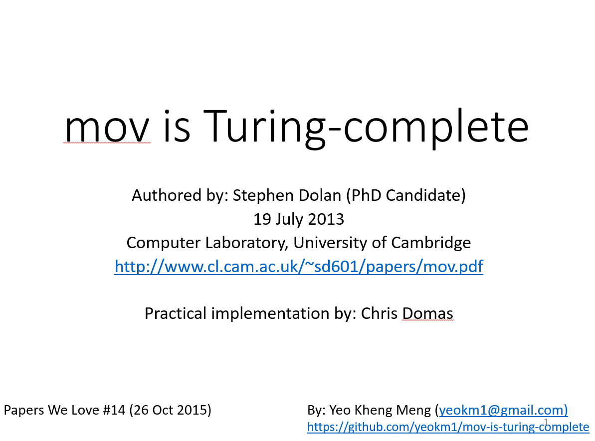

#mov-is-turing-complete

A talk about the academic paper "mov is Turing-complete" written by Stephan Dolan. Practical examples from movcc compiler by Chris Domas.

Simple C programs are in the demos directory. My slides are available on slideshare in the picture link below.

References
====
1. [Original Paper Source by Stephan Dolan](https://www.cl.cam.ac.uk/~sd601/papers/mov.pdf)
2. [Movfuscator](https://github.com/xoreaxeaxeax/movfuscator)
3. [Presentation by Movfuscator's developer Chris Domas](https://www.youtube.com/watch?v=R7EEoWg6Ekk)
